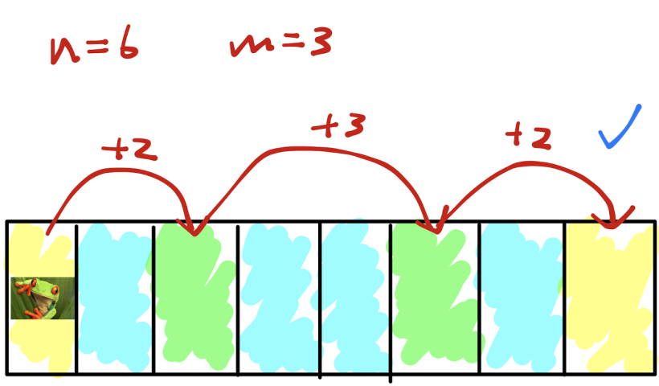

# **Challenge 156: Frog, Part I**

**Difficulty: 2/10  
Labels: Greedy, Implementation**

Tom is a happy little Frog living in a 1D pond represented by an array of `N` squares. Each square either contains a lilypad or is pure water. Tom can jump; however, he can only jump a maximum of `M` squares forward. He can crawl on consecutive lilypads as much as he wants, though.
Can Tom reach the other end of the pond without falling into the water?

## Task

You are given a number `T` and `T` test cases follow, for each test case:

- The first line contains two integers `N` and `M`.
- The next line contains a string of `N` characters. Each character is either `.` or `#`. `.` means the square is water and `#` means the square is a lilypad.

If we label the squares `1, 2, ..., N`, then Tom starts at square `0` and wants to go to square `N+1`. Assume squares `0` and `N+1` are not water. If Tom can only jump a maximum of `M` squares forward, output `YES` if it is possible for him to reach the other end. Otherwise, output `NO`.

### Examples

#### Input

```rust
5
6 3
.#..#.
10 2
##.###.#..
15 50
.##..#.......##
4 1
.###
7 1
#######
```

#### Output

```rust
‌YES
NO
YES
NO
YES
```

- For test case 1, Tom can jump 2 squares forward to a lilypad, then 3 squares, then 2 squares to reach the end. A sketch is attached below.

    

- For test case 2, Tom cannot make the last jump as it requires him to jump 3 squares forward when his capability (M) is 2.
- For test case 5, although Tom can barely jump, he can simply crawl to the other end.

### Note

- `1 <= T`
- `1 <= N, M <= 20,000`

### Submissions

Code can be written in any of these languages:

- `Python` 3.10
- `C` (gnu17) / `C++` (c++20) - GCC 11.2
- `Ruby` 3.1
- `Golang` 1.19
- `Java` 19 (Open JDK) - use **"class Main"!!!**
- `Rust` 1.68.2
- `C#` 10 (.Net 6.0)
- `JavaScript` ES2022 (Node.js 18.10)


To download tester for this challenge click [here](https://downgit.github.io/#/home?url=https://github.com/Pomroka/TWT_Challenges_Tester/tree/main/Challenge_156)
