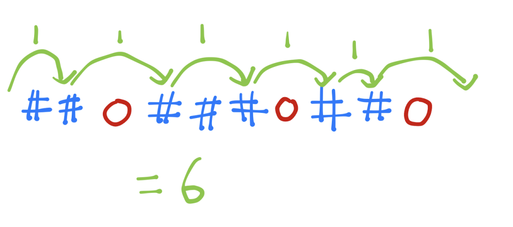

# Challenge 157: Frog, Part II

**Difficulty: 4/10  
Labels: Greedy**

This challenge **continues from the story of Challenge 156**. Read the previous challenge if you haven't done so.

Now, Tom wonders how long it would take him to get to the other side. Tom crawls forward one cell in 1 second and jumps forward any number of cells to his capacity also in 1 second. Compute the least number of seconds he needs to reach the other end.
Note that the input is exactly the same as the previous challenge. But instead of Yes/No, you are asked to find the minimum time.

## Task

You are given a number `T` and `T` test cases follow, for each test case:

- The first line contains two integers `N` and `M`.
- The next line contains a string of `N` characters. Each character is either `.` or `#`. `.` means the square is water and `#` means the square is a lilypad.

If we label the squares `1, 2, ..., N`, then Tom starts at square `0` and wants to go to square `N+1`. Assume squares `0` and `N+1` are not water.

If Tom can only jump a maximum of `M` squares forward. Output the minimum time, in seconds, for Tom to reach the other end. If it is impossible, output `-1`.

### Examples

#### Input

```rust
‌5
6 3
.#..#.
10 2
##.###.#..
10 2
##.###.##.
15 50
.##..#.......##
7 1
#######
```

#### Output

```rust
‌3
-1
6
1
8
```

- For test case 1, it takes `1` second each for Tom to jump on each of the 2 lilypads, and then onto the other end.
- For test case 3, the solution is below.



### Note

`1 <= T`
`1 <= N, M <= 20,000`

### Submissions

Code can be written in any of these languages:

- `Python` 3.10
- `C` (gnu17) / `C++` (c++20) - GCC 11.2
- `Ruby` 3.1
- `Golang` 1.19
- `Java` 19 (Open JDK) - use **"class Main"!!!**
- `Rust` 1.68.2
- `C#` 10 (.Net 6.0)
- `JavaScript` ES2022 (Node.js 18.10)

To download tester for this challenge click [here](https://downgit.github.io/#/home?url=https://github.com/Pomroka/TWT_Challenges_Tester/tree/main/Challenge_157)
