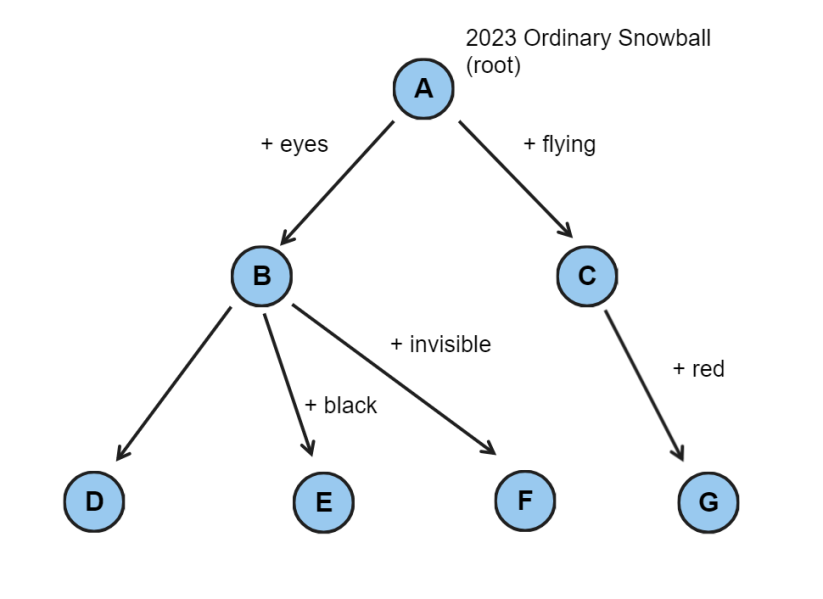

# Challenge 165: Snowball Evolution

**Difficulty: 5/10  
Labels: Graph Theory, Sets**

SnowballSH recently acquired the ability to travel to the future. In the year 3023, he discovers that the ordinary-looking objects, snowballs, have now transformed into living creatures and have evolved over the past 100 years! Similar to animals, snowballs now possess various traits based on an evolutionary tree.

Refer to the attached image for an example of such an evolutionary tree.
At each descendant level in the tree, either all snowballs evolve a new trait (such as red, below, where all flying snowballs became red), or there is a divergent split in the population where some of the snowballs evolve a new trait (e.g., invisible) and some do not.
Snowballs acquire traits from all of their ancestors. For example, `F` would have both the `invisible` trait **and** the `eyes` trait.

An evolutionary tree like the one attached is called **"proper"** if each newly evolved trait originates in **exactly one branch** of the tree. For example, the tree attached would not be proper if the edge `B->D` also gave snowball the "flying" trait (if so, two different branches would give birth to the "flying" trait).

Given a description of some snowballs in 3023, determine if these can be described by a **proper** evolutionary tree.

## Task

You are given a number `T` and `T` test cases follow, for each test case:

- The first line contains an integer `N`, the number of snowball descriptions.
- `N` lines follow. Each line contains a list of traits this snowball has.

Output `YES` if it is possible to form a proper evolutionary tree explaining the origin of these snowballs, and `NO` otherwise.

### Examples

#### Input

```rust
‌3
4
eyes black
red flying
eyes
invisible eyes
3
firebreathing
electric firebreathing
electric
2
psychic
floating psychic
```

#### Output

```rust
‌YES
NO
YES
```

- For testcase 1, a proper tree can be constructed, as in the image attached. The four snowballs are `E,G,D,F`, in order.

- For testcase 2, consider the first two snowballs. For the tree to be proper, there must be a `firebreathing` trait branching into `+electric`. However, by the 3rd snowball we must also have a `+electric` branch without `firebreathing` as an ancestor. This means we must have at least two `+electric` branches, so the answer is `NO`.

## Note

- `1 <= T`
- `2 <= N <= 15`
- `1 <= # of traits in each snowball <= 15`
- There are no duplicate traits in each snowball.
- Each trait consists of up to 15 lowercase English alphabets `a-z`.

Idea source: USACO Bronze

### Hint

Note that the input constraint is extremely small. Don't be afraid to use multiple nested loops.

1. ||Example testcase 2 is a minimal case for the answer to be `NO`. Why?||
2. ||Draw each example testcase in the form of Venn Diagrams. What makes the answer `NO`?||

### Submissions

Code can be written in any of these languages:

- `Python` 3.10
- `C` (gnu17) / `C++` (c++20) - GCC 11.2
- `Ruby` 3.1
- `Golang` 1.19
- `Java` 19 (Open JDK) - use **"class Main"!!!**
- `Rust` 1.68.2
- `C#` 10 (.Net 6.0)
- `JavaScript` ES2022 (Node.js 18.10)



To download tester for this challenge click [here](https://downgit.github.io/#/home?url=https://github.com/Pomroka/TWT_Challenges_Tester/tree/main/Challenge_165)
