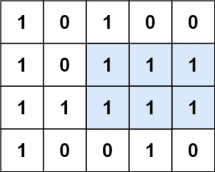

# Challenge 89: Largest Binary Rectangle

Given a `rows x cols` binary matrix filled with `0`'s and `1`'s, find the largest rectangle containing only `1`'s and return its area.

## Task

You are given a number `T` and `T` testcases follow, for each testcase you are given a line consisting of `a` and `b` - `a` being the number of columns and `b` being the number of rows. `b` lines follow with `a` elements (`0` or `1`). Find the largest group of `1`'s that form a rectangle.

## Examples

### Input

```rs
1
5 4
1 0 1 0 0
1 0 1 1 1
1 1 1 1 1
1 0 0 1 0
```

### Output

```rs
6
```

### Explanation


The maximal rectangle is shown in the above picture.

Challenge suggested by <@791545147836858389>

## Submissions

Code can be written in any of these languages:

- `Python` 3.9
- `C/C++` (GCC 10.3)
- `Ruby` 3.0
- `Golang` 1.16
- `Java` 18
- `Rust` 1.58

To download tester for this challenge click [here](https://downgit.github.io/#/home?url=https://github.com/Pomroka/TWT_Challenges_Tester/tree/main/PreviousChallenges/Challenge_89)
